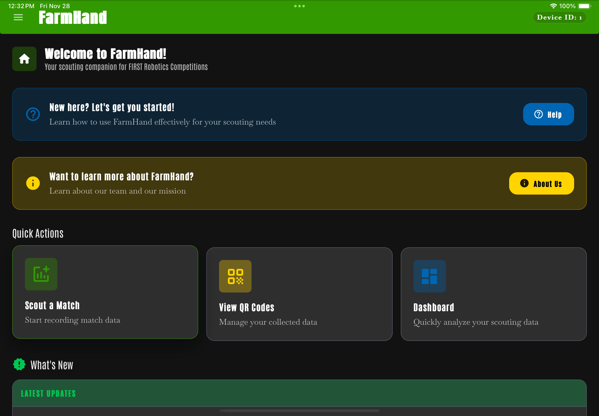
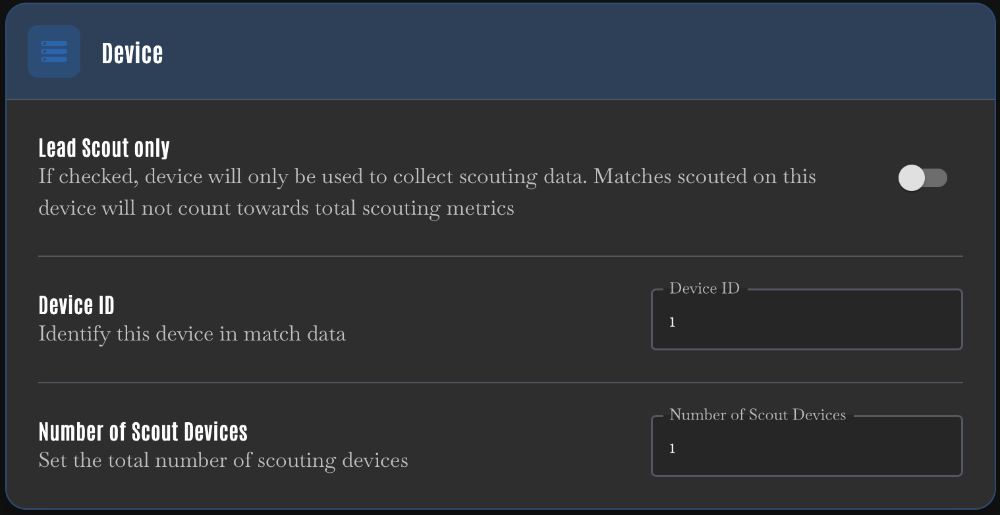
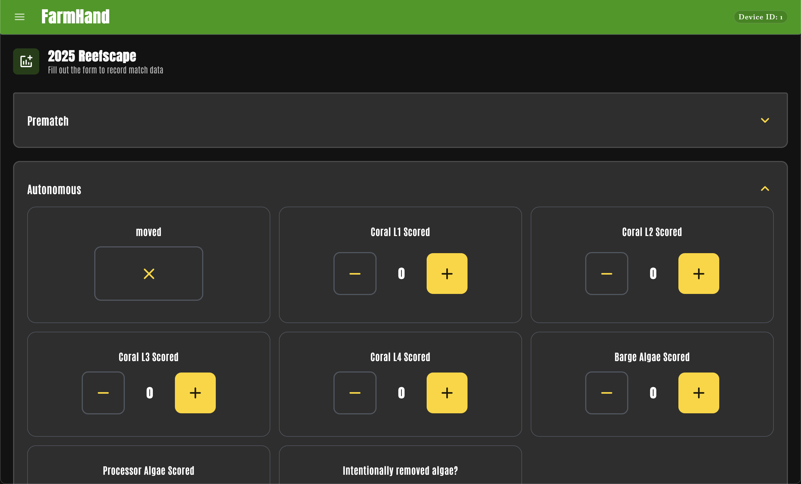
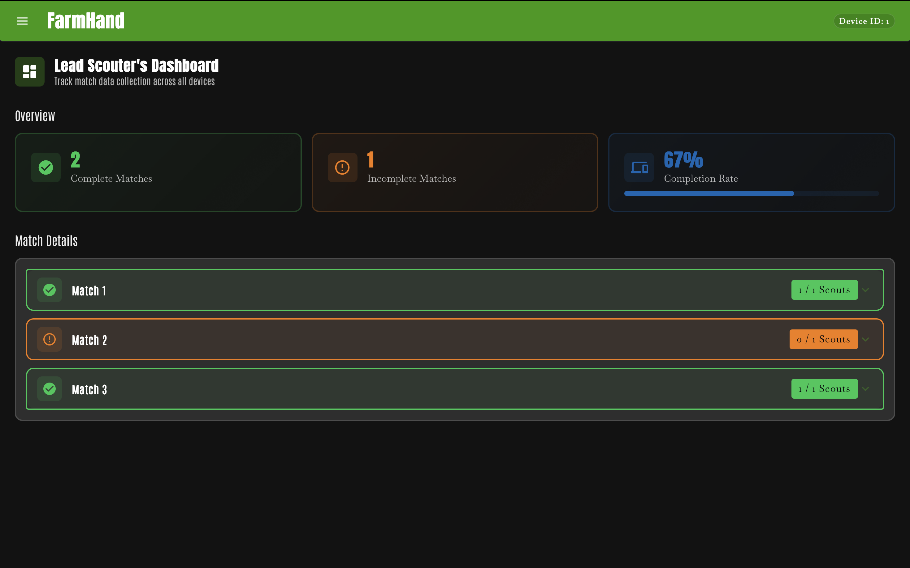

# FarmHand

A free, versatile scouting app for FIRST Robotics Competition (FRC) teams. FarmHand makes it easy to collect, organize, and share match data with customizable schemas and seamless QR code integration.



## What is FarmHand?

FarmHand is a cross-platform scouting application designed to help FRC teams efficiently collect and manage match data during competitions. Whether you're a veteran team or just starting out, FarmHand provides the tools you need to scout effectively.

### Key Features

- **Customizable Schemas**: Create and edit scouting forms tailored to your team's needs
- **QR Code Sharing**: Transfer match data between devices instantly using QR codes
- **Multi-Device Support**: Coordinate multiple scouts with device IDs
- **Data Management**: Archive completed matches and export data for analysis
- **Themes**: Customize the app's appearance with multiple built-in themes
- **Cross-Platform**: Works on desktop (Windows, macOS, Linux) and mobile (iOS, Android)

## Download

Download the latest release of FarmHand for your platform:

**[📦 Download FarmHand from GitHub Releases](https://github.com/Team3655/FarmHand/releases)**

Available for:

- **Windows** - MSI installer or portable EXE
- **Android** - APK file
- **macOS** - Coming soon
- **Linux** - Coming soon

## Getting Started

### Prerequisites

- [Tauri](https://v2.tauri.app/start/prerequisites) (contains instructions for all other prerequisites)
- [Git](https://git-scm.com/downloads)

For mobile development:

- **iOS**: Xcode and CocoaPods (Only on MacOS)
- **Android**: Android Studio and Android SDK

### Building Locally

1. **Clone the repository:**

   ```shell
   git clone https://github.com/your-username/FarmHand.git
   cd FarmHand
   ```

2. **Install dependencies:**

   ```shell
   npm install
   ```

3. **Start the development server:**

   ```shell
   npm run start
   ```

   This will open the app in a window (desktop) and launch the development build at `localhost:1420`

   For mobile development:

   ```shell
   npm run start-ios      # For iOS
   npm run start-android  # For Android
   ```

4. **Build for production:**
   ```shell
   npm run build
   npm run tauri build
   ```

## How to Use FarmHand

### First Time Setup

1. Open **Settings** from the navigation menu
2. Set your **Device ID** A unique id for each device your team will use for scouting. (Usually 1-6)
3. Enable **"Lead scout only"** if this device will only collect and export data
4. Select your **scouting schema** (e.g., "2025 Reefscape")
5. Configure the total number of scout devices your team is using

 

### Scouting a Match

1. Navigate to the **Scout** page
2. Fill out the form fields according to your schema
3. Save the match data
4. Generate a QR code to share with other devices



### Managing Data

- **Dashboard**: View and manage your current match data
- **QR Codes**: Scan or generate QR codes to transfer data between devices
- **Archive**: Access completed matches for long-term storage
- **Schemas**: Create and edit custom scouting schemas in Settings

 

For more detailed instructions, check out the **Help** page within the app!

## Tech Stack

- **[React](https://reactjs.org/)** - UI framework
- **[Material-UI (MUI)](https://mui.com/)** - Component library
- **[Tauri](https://v2.tauri.app/)** - Cross-platform framework
- **[TypeScript](https://www.typescriptlang.org/)** - Type safety
- **[Vite](https://vitejs.dev/)** - Build tool

## Contributing

We welcome contributions! Please see [CONTRIBUTING.md](CONTRIBUTING.md) for guidelines on how to contribute to this project.

## Changelog

View a structured log of all the version changes to this app: [CHANGELOG.md](CHANGELOG.md)

## License

This project is licensed under the MIT License - see the [LICENSE](LICENSE) file for details.
